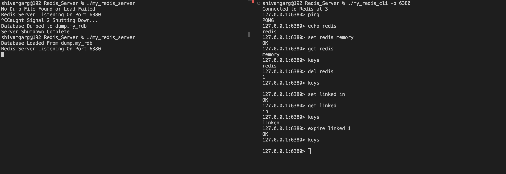

# Redis Server in C++

A lightweight, Redis-compatible in-memory data store implementation written in C++. This project provides core Redis functionality with full RESP protocol support, multi-client concurrency, and automatic persistence.

## 🚀 Features

- **Redis Protocol Compatibility**: Full Redis Serialization Protocol (RESP) parsing
- **Multi-Client Support**: Concurrent client handling with thread-safe operations
- **Data Types**: Support for strings, lists, and hashes
- **Automatic Persistence**: Periodic disk dumps every 5 minutes with graceful shutdown persistence
- **Standard Redis Commands**: Compatible with `redis-cli` and other Redis clients

## 📋 Supported Commands

### Connection & Utility
- `PING` - Test server connectivity
- `ECHO <message>` - Echo back the given message
- `FLUSHALL` - Clear all stored data

### Key-Value Operations
- `SET <key> <value>` - Store a string value
- `GET <key>` - Retrieve a string value
- `KEYS *` - List all keys in the database
- `TYPE <key>` - Get the data type of a key
- `DEL <key>` / `UNLINK <key>` - Delete a key
- `EXPIRE <key> <seconds>` - Set key expiration time
- `RENAME <old_key> <new_key>` - Rename a key

## 🛠️ Installation

### Prerequisites
- C++17 compatible compiler (GCC, Clang, etc.)
- Make utility
- POSIX-compliant system (Linux, macOS)

### Build from Source

```bash
# Clone the repository
git clone https://github.com/shivamgarg001/Redis-Server
cd Redis-Server

# Build using Makefile
make

# Or compile manually
g++ -std=c++17 -pthread -Iinclude src/*.cpp -o my_redis_server
```

### Clean Build
```bash
make clean
```

## 🚀 Usage

### Starting the Server

```bash
# Start on default port (6380)
./my_redis_server

# Start on custom port
./my_redis_server 6381
```

The server will attempt to load existing data from `dump.my_rdb` on startup and will display:
```
Database Loaded From dump.my_rdb
```
or
```
No dump found or load failed; starting with an empty database.
```

### Connecting to the Server

#### Using redis-cli
```bash
redis-cli -p 6380

# Example session
127.0.0.1:6380> PING
PONG
127.0.0.1:6380> SET mykey "Hello World"
OK
127.0.0.1:6380> GET mykey
"Hello World"
```

#### Using Custom Client
The project includes a custom Redis CLI client (`my_redis_cli`) based on the open-source [Redis-CLI](https://github.com/Cukowski/Redis-CLI).

```bash
# Connect to server running on same machine
./my_redis_cli -h 127.0.0.1 -p 6380

# Connect to server on different machine (use actual IP address)
./my_redis_cli -h 192.168.1.10 -p 6380

# Where:
# -h: Host IP address (use your WiFi IP address for network connections)
# -p: Port number (default 6380, or custom port if specified when starting server)
```

**Finding Your IP Address:**
- Linux/macOS: `ip addr show` or `ifconfig`
- Windows: `ipconfig`
- Look for your WiFi adapter's IP address (usually starts with 192.168.x.x or 10.x.x.x)

## 🏗️ Architecture

### Project Structure
```
├── include/                    # Header files
│   ├── RedisCommandHandler.h   # Command parsing and execution
│   ├── RedisDatabase.h         # Data storage and management
│   └── RedisServer.h           # TCP server implementation
├── pics/                      
│   └── redis.png               # Redis Server and CLI test
├── src/                        # Source files
│   ├── RedisCommandHandler.cpp
│   ├── RedisDatabase.cpp
│   ├── RedisServer.cpp
│   └── main.cpp               # Application entry point
├── Makefile                   # Build configuration
└── my_redis_cli               # Custom Redis Client
└── README.md                  # Documentation
```
## 📱 Screenshots



### Design Principles

- **Thread Safety**: Global mutex (`RDB_mutex`) ensures thread-safe operations across all data stores
- **Concurrency**: Each client connection is handled in its own thread using `std::thread`
- **Singleton Pattern**: `RedisDatabase::getInstance()` provides a single shared database instance
- **RESP Protocol**: Custom parser supporting both inline and array command formats
- **Persistence**: Simplified RDB format with text-based serialization to `dump.my_rdb`

### Data Storage
- **Key-Value Store**: `std::unordered_map<string, string>` for string data types
- **Automatic Backups**: Background thread performs database dumps every 300 seconds
- **Graceful Shutdown**: `Ctrl+C` triggers immediate persistence before exit

## 🔧 Configuration

- **Default Port**: 6380 (configurable via command line)
- **Persistence File**: `dump.my_rdb`
- **Backup Interval**: 300 seconds (5 minutes)
- **Protocol**: Redis Serialization Protocol (RESP)